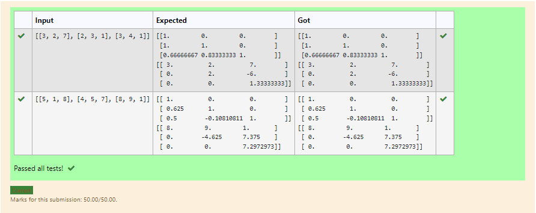
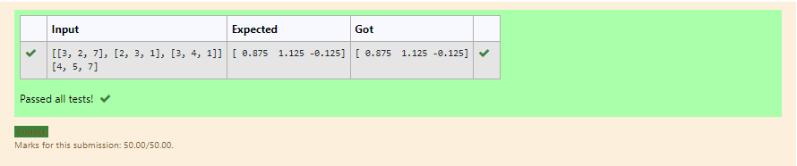

# LU Decomposition without zero on the diagonal

## AIM:
To write a program to find the LU Decomposition of a matrix.

## Equipments Required:
1. Hardware – PCs
2. Anaconda – Python 3.7 Installation / Moodle-Code Runner

## Algorithm
1. import numpy library using import statement.

2. From scipy package import lu().

3. Get input from user and pass it as an array.

4. Get P, L U martix using lu().

5.print L and U matrix.


## Program:
```
/*
Program to find the LU Decomposition of a matrix.
Developed by:KADIN SAMSON L 
RegisterNumber: 21001514
*/
from scipy.linalg import lu 
a=eval(input())
p,l,u=lu(a)
print(l)
print(u)
```

## Output:


## Result:
Thus the program to find the LU Decomposition of a matrix is written and verified using python programming.


# LU Decomposition without zero on the diagonal

## AIM:
To write a program to find the LU Decomposition of a matrix.

## Equipments Required:
1. Hardware – PCs
2. Anaconda – Python 3.7 Installation / Moodle-Code Runner

## Algorithm
1. import numpy library using import statement.

2. From scipy package import lu_factor() and lu_solve().

3. Get two inputs from user and pass it as ,matrux array.

4. find lu and pivot value of first marix using lu_factor().

5.find solution of the matrix by using lu_solve() and pass lu, pivot values and second matrix as arguments.

6. Print the solution.

## Program:
```
/*
Program to find the LU Decomposition of a matrix.
Developed by:KADIN SAMSON L 
RegisterNumber: 21001514
*/
import numpy as np
from scipy.linalg import lu_factor,lu_solve
a=eval(input())
b=eval(input())
lu,plv=lu_factor(a)
x=lu_solve((lu,plv),b)
print(x)
```

## Output:


## Result:
Thus the program to find the LU Decomposition of a matrix is written and verified using python programming.

